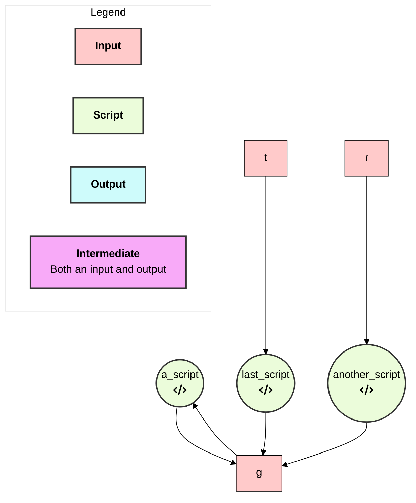

# vis_repo_pipeline
A tool to visualize repository pipelines of script inputs and outputs

```mermaid
 %%{init: {'theme':'base', 'themeVariables': {
  'primaryColor': '#ffcaca',
  'primaryTextColor': '#000',
  'primaryBorderColor': '#000000',
  'lineColor': '#000000',
  'tertiaryColor': '#fff'
}}}%%
graph TD
classDef lightRed fill:#ffcaca,stroke:#333,stroke-width:2px;
classDef lightGreen fill:#ebfcda,stroke:#333,stroke-width:2px;
classDef lightBlue fill:#cefbfb,stroke:#333,stroke-width:2px;
classDef lightPurple fill:#f8aaf8,stroke:#333,stroke-width:2px;

subgraph Legend
    key1[<b>Input]:::lightRed
    key2[<b>Script]:::lightGreen
    key3[<b>Output]:::lightBlue
    key4[<b>Intermediate</b><br> Both an input and output]:::lightPurple
end
a_script(("a_script")):::lightGreen
a_script(("a_script
 fa:fa-code"))
g --> a_script
a_script --> g
last_script(("last_script")):::lightGreen
last_script(("last_script
 fa:fa-code"))
t --> last_script
last_script --> g
another_script(("another_script")):::lightGreen
another_script(("another_script
 fa:fa-code"))
r --> another_script
another_script --> g
```
