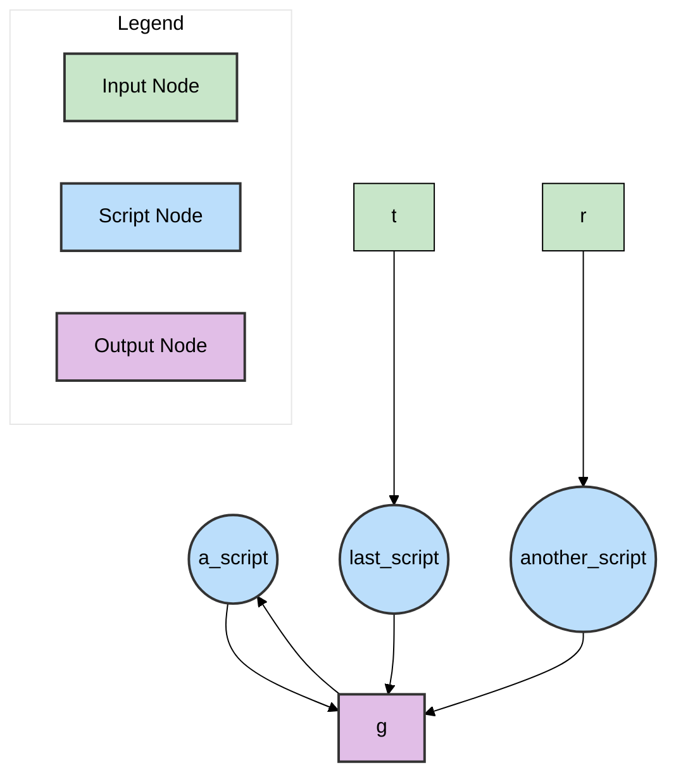

```mermaid
%%{init: {'theme':'base', 'themeVariables': { 'primaryColor': '#C8E6C9', 'primaryTextColor': '#000', 'primaryBorderColor': '#000000', 'lineColor': '#000000', 'tertiaryColor': '#fff' }}}%%
graph TD
classDef lightGreen fill:#C8E6C9,stroke:#333,stroke-width:2px;
classDef lightBlue fill:#BBDEFB,stroke:#333,stroke-width:2px;
classDef lightPurple fill:#E1BEE7,stroke:#333,stroke-width:2px;

subgraph Legend
    key1[Input Node]:::lightGreen
    key2[Script Node]:::lightBlue
    key3[Output Node]:::lightPurple
end
a_script(("a_script"))
g --> a_script:::lightBlue
a_script --> g:::lightPurple
last_script(("last_script"))
t --> last_script:::lightBlue
last_script --> g:::lightPurple
another_script(("another_script"))
r --> another_script:::lightBlue
another_script --> g:::lightPurple
```
